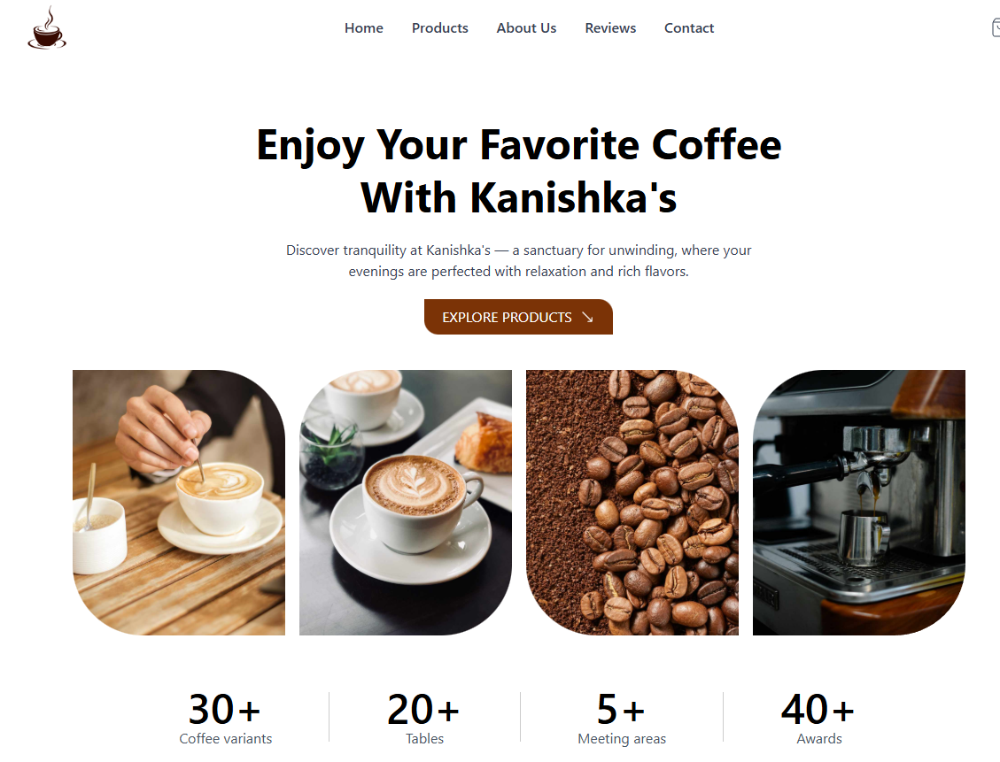
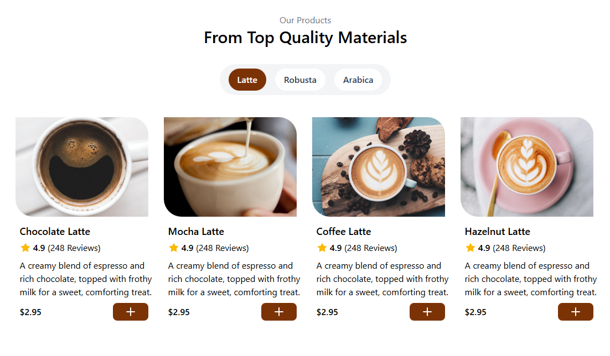
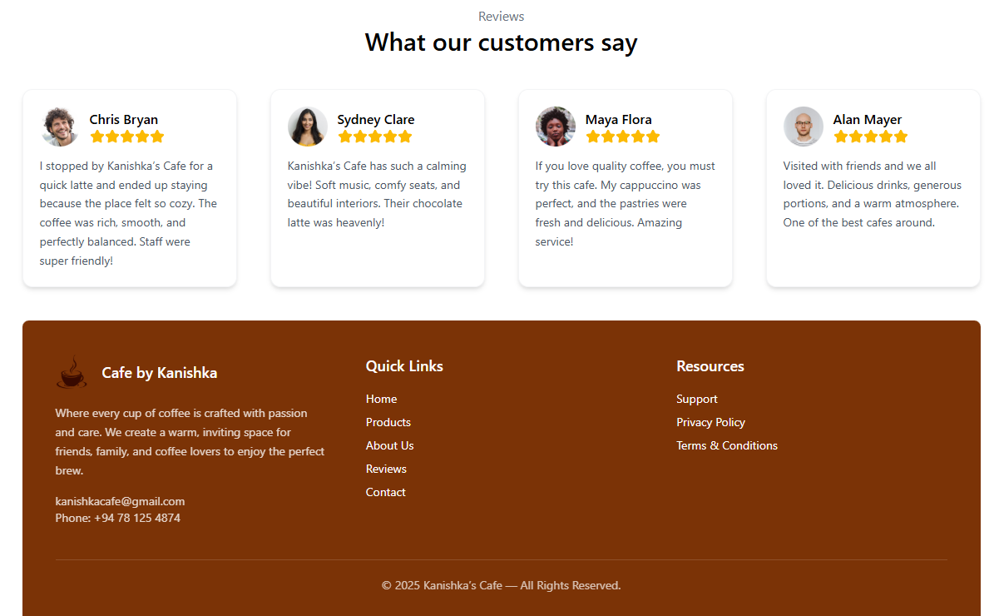
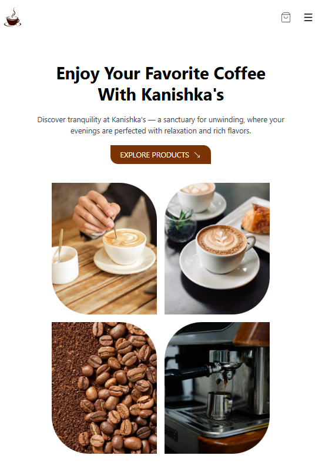

# ☕ Kanishka’s Cafe – Modern Coffee Shop Website

A beautifully designed, mobile-responsive coffee shop website built using **React**, **Vite**, **Tailwind CSS**, and **Lucide Icons**.
This project showcases product listings, reviews, an about section, and a clean, minimal UI suited for modern café branding.

---

## 🚀 Features

### ✨ Frontend

- Fully responsive layout (mobile, tablet, desktop)
- Modern navigation bar with hamburger menu
- Smooth UI with Tailwind utilities
- Product section with categories (Latte, Robusta, Arabica)
- Reviews, About, and Contact sections
- Reusable React components
- Clean color palette and typography

---

## 🛠️ Tech Stack

| Technology            | Purpose                            |
| --------------------- | ---------------------------------- |
| **React**             | Component-based UI                 |
| **Vite**              | Fast React development environment |
| **Tailwind CSS**      | Modern utility-first styling       |
| **Lucide-react**      | Beautiful icon set                 |
| **JavaScript (ES6+)** | Logic & interactivity              |

---

## 📂 Project Structure

```
src/
│── components/
│   ├── Hero.jsx
│   ├── Products.jsx
│   ├── CoffeeCard.jsx
│   └── ...
│
│── assets/
│   ├── logo.png
│   └── Products/
│       ├── 3.png
│       ├── 4.png
│       ├── 5.png
│       └── 6.png
│
│── App.jsx
│── main.jsx
└── index.html
```

---

## 🔧 Installation & Setup

### 1️⃣ Clone the repository

```bash
git clone https://github.com/yourusername/your-repo-name.git
cd your-repo-name
```

### 2️⃣ Install dependencies

```bash
npm install
```

### 3️⃣ Run development server

```bash
npm run dev
```

### 4️⃣ Build for production

```bash
npm run build
```

---

## 📸 Screenshots

  
  
  
  

> Tip: Add screenshots inside a `/screenshots` folder and link them here.

---

## 🌟 Future Improvements

- Add backend ordering system
- Add database for real product data
- Online payment integration
- Admin dashboard
- Customer login system

---

## 🧑‍💻 Author

**Kanishka Dahampath**
Front-end Developer | Designer

If you like this project, don't forget to ⭐ the repository!

---

## 📄 License

This project is licensed under the **MIT License** – feel free to use and modify it.
